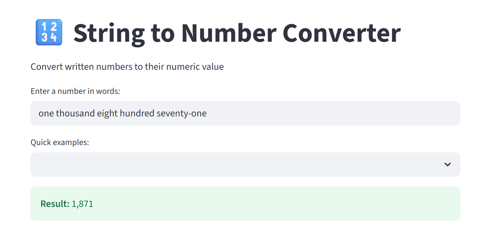

# String to Number Converter

A web app that translates English-written numbers into digits. Because typing "twenty-five" and seeing "25" appear on screen is the future we all dreamed of.

## Preview



## Features

* Bleak, distraction-free interface
* Instant gratification for trivial tasks
* Handles anything from "zero" to "a number you won't ever actually write in words"
* A button to save you from the exhausting task of typing out your own example

## Installation

Assuming you really want this on your machine:

1. Clone this repository:
```bash
git clone https://github.com/gaeldatascience/string_to_number.git
cd string_to_number
```

2. Install dependencies using uv:
```bash
uv sync
```

## Usage

For when you're truly out of other things to do:

```bash
uv run streamlit run app.py
```

Then proceed to open your browser (yes, manually) and visit:
[http://localhost:8501](http://localhost:8501)

## Examples

Because you might still be wondering what this revolutionary tool does:

* `twenty three` → 23
* `one hundred twenty three` → 123
* `five thousand six hundred seventy eight` → 5,678
* `one million two hundred thousand` → 1,200,000

Enjoy the convenience of something you probably won't need again.